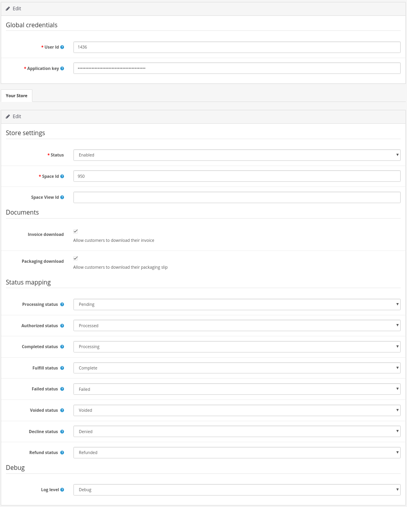
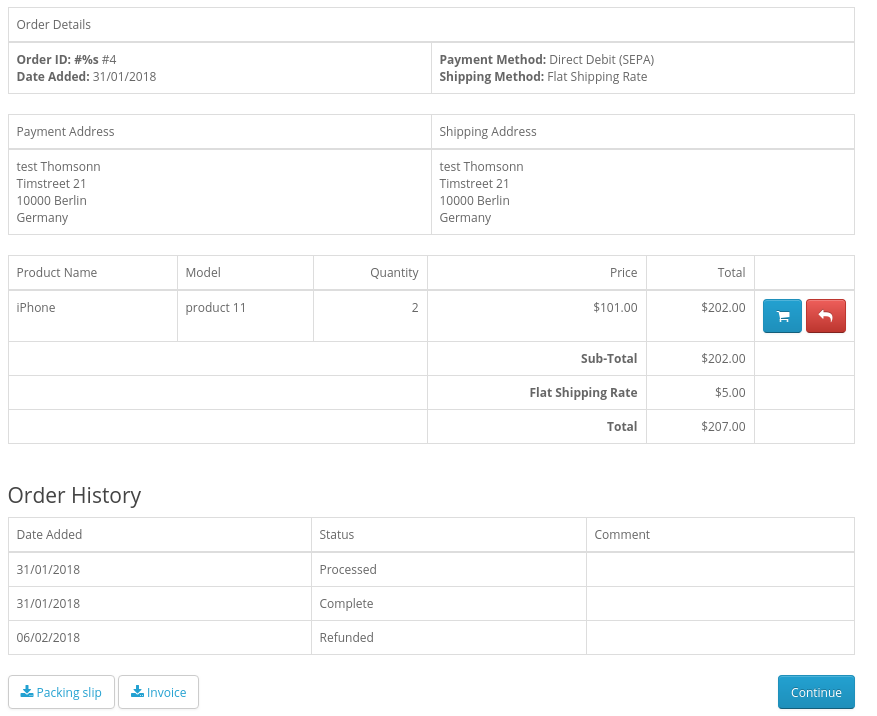
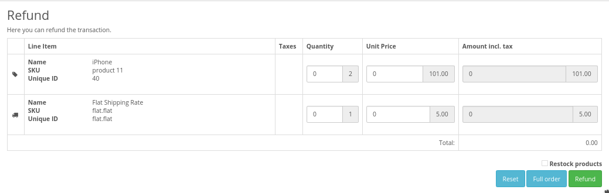
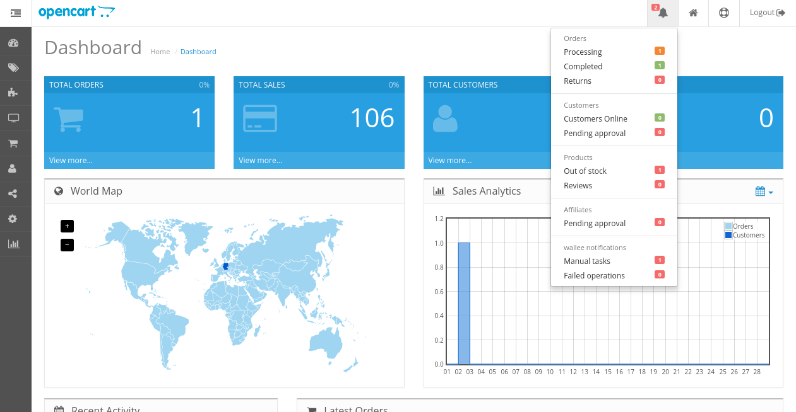
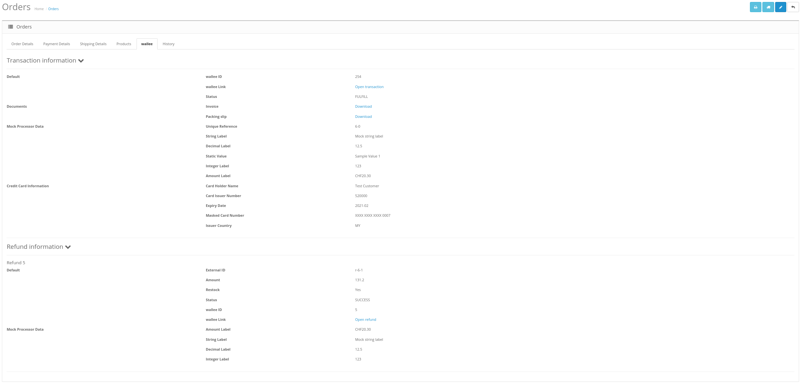

# Opencart 2.0 Wallee Integration BETA
This repository contains the Opencart wallee payment module that enables the shop to process payments with [wallee](https://wallee.com/).

##### To use this extension, a [wallee](https://wallee.com/) account is required.

## Requirements

* [Opencart](https://www.opencart.com/) 2.0.x
* [PHP](http://php.net/) 5.4 or later

## Documentation

### Prerequisites

1. If you don't already have one, create a [wallee](https://app-wallee.com/user/signup) account, set up a space and sign up for an OpenCart account.
2. Create an application user that is allowed to access the space you want to link to the OpenCart store. Navigate to your wallee account > application user and create your application user. The user ID and the authentication key will be shown to you.

3. Make sure that you grant the application users the necessary rights (Account Admin) in order to configure the webhooks, payment methods etc. out of your Opencart store. 
4. Setup at least one each of processor, payment method and connector configuration. More information about the [processor concept](https://app-wallee.com/doc/payment) can be found in the documentation.

### Installation

#### Manual installation

The easiest way to install the plugin is by uploading the files directly.

1. Upload the contents of the upload folder to the store's root directory using FTP/SSH.
2. The plugin will now be visible under your **Payments**. You can install the plugin directly from here. After the plugin is installed, you can open the configuration.

#### Extension installer

The plugin can also be installed using OpenCarts **Extension Installer**.

1. Compress the upload folder to a ZIP file.
2. Rename the file extension from .zip to .ocmod.zip
3. Open the **Extension Installer** in your OpenCart backend
4. Upload the zipped directory using the **Extension Installer**
5. The plugin will now be visible under your **Payments**. You can install the plugin directly from here. After the plugin is installed, you can open the configuration.

### Configuration

1. Open the extensions configuration page
2. Enter the User ID, Application User Key and Space ID
3. Configure the status mapping so it matches. The defaults should be correct, but may differ depending on your workflow, or any custom statusses already in use. Check our [transaction states](https://app-wallee.com/en-us/doc/payment/transaction-process) page for more information.
4. Set if you want invoices and packing slips to be available to the customer from the OpenCart frontend.
4. Save the configuration
5. Refresh modifications

The extension will automatically configure itself and create all required files after completing these steps. Payment methods and webhooks are registered automatically and will be available in the store.

If you have configured a separate currency to have a non-1.00 value please be aware that there may be rounding errors due to the way OpenCart handles currency totals and taxes.

Note that webhooks will not arrive if maintenance mode is active. This results in orders not being completed.

## Features

### Payment methods & webhooks

The extension will pull any configured payment methods and webhooks from your wallee account. Note: The payment methods will not appear in the payment overview of your OpenCart backend.

### Packing slips & invoices

You may allow customers to download their own packing slips and / or invoices. This can be configured in the extension settings page. The download buttons are available in the customers order view. The documents are made available in the PDF format.

### Refunds

The extension allows transactions made with it to also be refunded directly from the opencart backend if the transaction is in the correct state.

### Completion

Orders can be processed in two steps depending on your wallee configurations. In the case of manual completions the order stays in a reserved state until the merchant confirms that the funds should be transferred. A completion can be initiated from the order view in your OpenCart backend if the transaction is in the correct state.

### Void

Orders which are processed in two steps can be voided instead of completed. A void can be initiated from the order view in your OpenCart backend if the transaction is in the correct state.

### Alerts

If there are open manual tasks in your wallee account, or if a non-synchronous task such as a void, completion or refund fails, this information is displayed in your OpenCart backend.

### Transaction Information

Most information regarding the transaction can be directly viewed from the OpenCart backend. This includes any configured labels, invoices and packing slips. If there have been any completions, voids or refunds initiated from the OpenCart backend these will also be visible.

### Further information

Have a look at our documentation to get to know wallee in more details. There are a lot of interesting features that could be beneficial to you and save you a lot of money and time in your daily operations. Below there is just a list of the most important and most used features. 

* [ESR Orange Einzahlungsscheine](https://wallee.com/features/esr.html)
* [Document Templates](https://wallee.com/features/document-handling.html)
* [Integrated Processors](https://app-wallee.com/en/processors)
* [E-Mail Templates](https://wallee.com/features/document-handling.html)
* [Cloud Printing](https://wallee.com/features/cloud-printing.html)
* [Payment Routing](https://wallee.com/features/intelligent-payment-routing.html)

### Support

If you have questions use the support form in your space or use the [online form](https://wallee.com/support.html). 

## License

Please see the [license file](./LICENSE) for more information.

## Other Opencart Versions

Find the module for different Opencart versions [here](https://github.com/wallee-payment/openc